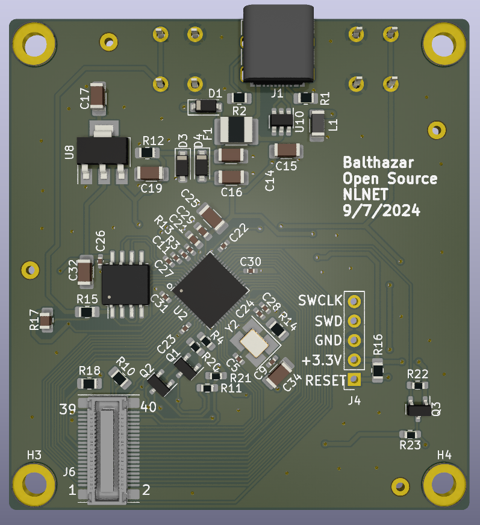

# Balthazar Thinkpad USB adapter

# About

This is a project attempting to make a USB keyboard/Trackpoint controller and enclosure for the non-chiclet Thinkpad keyboard (from the 10/20 generation, such as the T410, W520, X2xx series etc.). 
the idea is to connect a ThinkPad keyboard as a foreign or extrenal add-on to a housing fitting in a provided frame. External keyboard connects via click-on controller to the ThinkPad-adapter, which connects to our Unifying PCB.

# Controller

The current plan is to use an RP2040 microcontroller running QMK to handle the key matrix scanning and Trackpoint for TP keyboard.

# Project origin

If you need project with Sink Source USB along with USB HUB, please check this repository

https://github.com/bluepylons/A-Thinkpad-USB-keyboard

## License

CERN Open Hardware Licence Version 2 - Weakly Reciprocal

## Funding

This project is funded through the [NGI Zero Entrust Fund](https://nlnet.nl/entrust), a fund
established by [NLnet](https://nlnet.nl) with financial support from the European Commission's
[Next Generation Internet](https://ngi.eu) program. Learn more on the [NLnet project page](https://nlnet.nl/project/Balthazar-Casing/).

